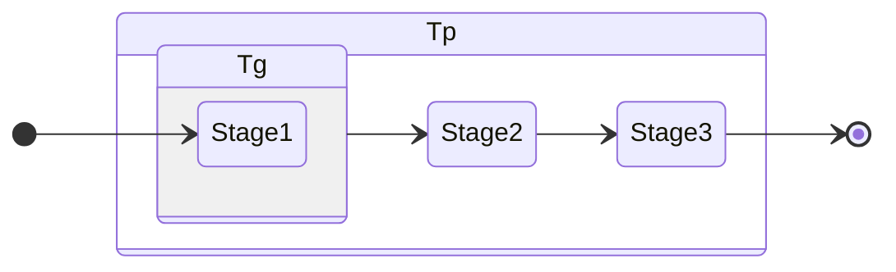
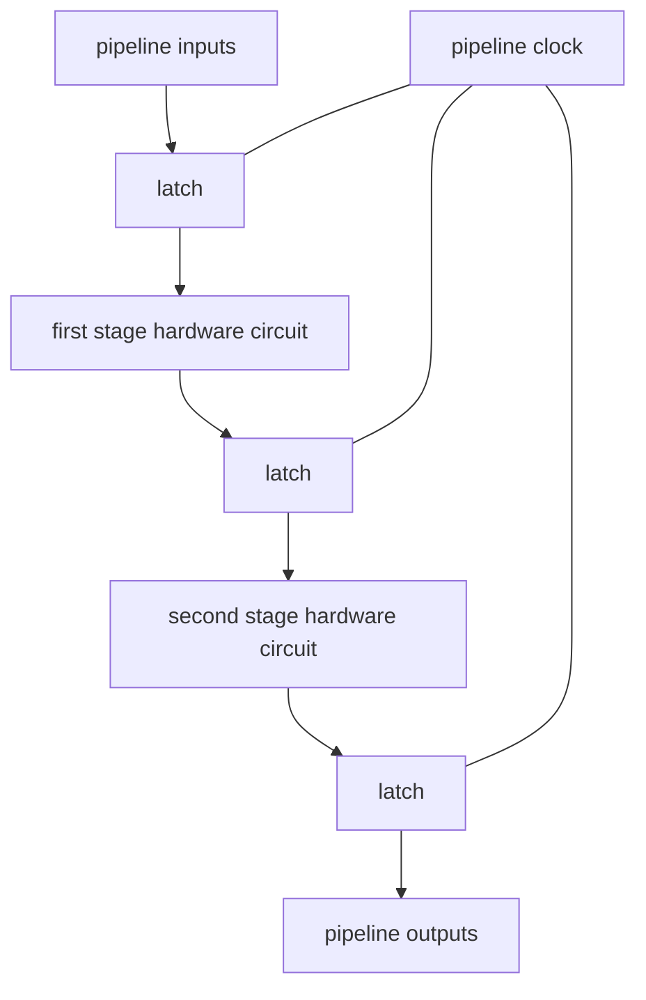

# สถาปัตยกรรมคอมพิวเตอร์

- [สถาปัตยกรรมคอมพิวเตอร์](#สถาปัตยกรรมคอมพิวเตอร์)
- [Historical perspective](#historical-perspective)
- [หมวดหมู่ computer architecture](#หมวดหมู่-computer-architecture)
- [Computer architecture ท่ีดี](#computer-architecture-ท่ีดี)
  - [Factors Influencing the Success of a Computer Architecture](#factors-influencing-the-success-of-a-computer-architecture)
    - [1. Architectural Merit](#1-architectural-merit)
    - [2. System Performance](#2-system-performance)
      - [CPU Performance Measures](#cpu-performance-measures)
      - [I/O Performance Measures](#io-performance-measures)
      - [Other Performance Measure](#other-performance-measure)
      - [Instruction-set Architecture (ISA)](#instruction-set-architecture-isa)
    - [3. System Cost](#3-system-cost)
- [Data Representations](#data-representations)
  - [character](#character)
  - [Numeric data](#numeric-data)
- [Data Structures](#data-structures)
  - [character strings](#character-strings)
  - [stacks](#stacks)
  - [arrays](#arrays)
  - [parameter–passage structures](#parameterpassage-structures)
- [Data Precision and Data Types](#data-precision-and-data-types)
  - [character set](#character-set)
  - [integer data](#integer-data)
  - [floating–point data](#floatingpoint-data)
- [Register Sets](#register-sets)
- [Register Operations](#register-operations)
  - [Register operations and architectures](#register-operations-and-architectures)
  - [Register Architectures](#register-architectures)
- [Various classifications of register architectures](#various-classifications-of-register-architectures)
  - [Evaluation-stack Architectures](#evaluation-stack-architectures)
  - [Accumulator Machines](#accumulator-machines)
  - [General-purpose Register-set Machines](#general-purpose-register-set-machines)
  - [Special-purpose Register-set Machines](#special-purpose-register-set-machines)
- [Types of Instructions](#types-of-instructions)
  - [1. Operate Instructions](#1-operate-instructions)
    - [Arithmetic, Logical and Shift Instructions](#arithmetic-logical-and-shift-instructions)
    - [Character and String processing Instructions](#character-and-string-processing-instructions)
    - [Stack and Register Manipulation](#stack-and-register-manipulation)
  - [2. Memory Access Instructions](#2-memory-access-instructions)
    - [LOAD และ STORE Instructions](#load-และ-store-instructions)
    - [LOAD ADDRESS INSTRUCTIONS](#load-address-instructions)
  - [3. Control Instructions](#3-control-instructions)
    - [Conditional และ Unconditional Branch Instructions](#conditional-และ-unconditional-branch-instructions)
    - [Branch Test](#branch-test)
    - [Subroutine–linkage Instructions](#subroutinelinkage-instructions)
  - [4. Miscellaneous and Privileged Instructions](#4-miscellaneous-and-privileged-instructions)
    - [I/O Instructions](#io-instructions)
    - [Interrupts](#interrupts)
    - [Privileged Instructions](#privileged-instructions)
- [Vector Instructions](#vector-instructions)
- [Addressing Techniques](#addressing-techniques)
  - [Register Addressing](#register-addressing)
  - [Boundary Alignment](#boundary-alignment)
- [Memory Addressing](#memory-addressing)
  - [Address Space](#address-space)
  - [Absolute Addressing](#absolute-addressing)
  - [Indexed Addressing](#indexed-addressing)
  - [Indirect Addressing](#indirect-addressing)
  - [Indexed-indirect Addressing](#indexed-indirect-addressing)
  - [Based-displacement Addressing](#based-displacement-addressing)
  - [PC-relative Addressing](#pc-relative-addressing)
  - [Stack-register Addressing](#stack-register-addressing)
  - [Autoincrement and Autodecrement Addressing](#autoincrement-and-autodecrement-addressing)
  - [Segment-register Addressing](#segment-register-addressing)
- [Addressing Design Issues](#addressing-design-issues)
- [Instruction-set Design](#instruction-set-design)
  - [Completeness](#completeness)
  - [Orthogonality](#orthogonality)
  - [Compatibility](#compatibility)
  - [Instruction Formats](#instruction-formats)
- [Buses, the CPU, and the I/O system](#buses-the-cpu-and-the-io-system)
  - [Buses](#buses)
  - [Central Processing Unit (CPU)](#central-processing-unit-cpu)
    - [ALU](#alu)
    - [Control Units](#control-units)
      - [Microprogrammed Control Unit](#microprogrammed-control-unit)
- [Organization of Microprograms in the Contril Store](#organization-of-microprograms-in-the-contril-store)
  - [1. Microprogrammed Control Units](#1-microprogrammed-control-units)
  - [2. Conventional Control Units](#2-conventional-control-units)
- [Exception-processing Hardware and Instructions](#exception-processing-hardware-and-instructions)
- [Exception Initiation](#exception-initiation)
- [I/O System](#io-system)
  - [1. CPU-controlled I/O](#1-cpu-controlled-io)
    - [a. multiprogramming operating systems](#a-multiprogramming-operating-systems)
    - [b. multiported storage systems](#b-multiported-storage-systems)
    - [c. I/O processors](#c-io-processors)
  - [2. DMA I/O](#2-dma-io)
  - [3. Memory – mapped I/O](#3-memory--mapped-io)
- [Pipelining and RISCs](#pipelining-and-riscs)
  - [Pipelining](#pipelining)
  - [Arithmetic-Unit Pipelining](#arithmetic-unit-pipelining)
  - [Instruction – unit Pipelining](#instruction--unit-pipelining)
  - [Scheduling Functional Units](#scheduling-functional-units)
  - [RISC](#risc)
  - [Historical Perspective](#historical-perspective-1)
- [RISC - CISC](#risc---cisc)
  - [CISC](#cisc)
  - [RISC](#risc-1)

สถาปัตยกรรมคอมพิวเตอร์ (Computer Architecture) คือการออกแบบของคอมพิวเตอร์มี instruction set, hardware components, and system organization มี 2 ส่วนคือ
1. Instruction-set architecture (ISA) กำหนด conputational charactistics ของ computer และ ISA จะประสบความสำเร็จได้ต้องมีหลากหลาย implementations เช่น personal computor มีหลาย specification คือมีหลายขนาด, performance, reliabilities, และ HSA แต่มี ISA เหมือนกัน คือเข้าใจคำสั่งเหมือนกันแม้ว่า hardware จะต่างกันก็ตาม (อย่างน้อยในตระกูล (computer-family architecture) เดียวกัน)
2. Hardware-system architecture (HSA) จัดการกับ hardware subsystems รวม central processing unit (CPU), storage system หรือ memory, และ input-output system (I/O) ดังนั้น HSA จะกำหนดประสิทธิภาพของคอมพิวเตอร์

Computer-family architecture หมายถึง set of implementation ที่มี ISA เหมือนกันหรือคล้ายกัน

Computer architects หรือสถาปนิกคอมพิวเตอร์มีหน้าที่สร้างตระกูลของคอมพิวเตอร์โดยใช้หลากหลายเทคโนโลยี หลายขนาดของความจำ และความเร็วต่างกัน ทำให้ performance สำหรับแต่ละโมเดลในตระกูลเดียวกันแตกต่างกัน แต่สามารถใช้งานโปรแกรมเดียวกันได้

Compatiblitity คือความสามารถของคอมพิวเตอร์ที่ต่างกันในการใช้งานโปรแกรมเดียวกัน สถาปนิกโดยทั่วไปออกแบบสำหรับการเข้ากันได้กับรุ่นหน้า (upward compatibility) คือการออกแบบใซ้รุ่นหน้าหรือรุ่นถัดไปสามารถใช้งานโปรแกรมได้ ซึ่งทำให้สมาชิกในตระกูลที่มีประสิทธิภาพสูงกว่า (heigh-performace family) สามารถทำงานโปรแกรมเดียวกันกับสมาชิกตระกูลที่มีประสิทธิภาพน้อยกว่า (lower-performance member)

# Historical perspective
เทคโนโลยีคอมพิวเตอร์ (computer technology) มีการพัฒนาอย่างรวดเร็ว ตั้งแต่ปลายปี ค.ศ. 1940s เมื่อ John Atanasoff ที่ Iowa State University สร้าง special – purpose electronic digital computer ชื่อ ABC

first-generation computer เป็น Laboratory machines ENIAC ซึ่งไม่ใช่ stored-program computer (University of Pennsylvania) EDSAC (University of Cambridge) MARK-I, MARK-II, MARK-III, MARK-IV (Harvard University) MARK-I, MARK-II ใช้ electromechanical relays แต่คอมพิวเตอร์ส่วนใหญ่ในยุคนั้นใช้ vacuum-tube และยังไม่มี transistor Univac ซึ่งเป็นคอมพิวเตอร์ผลิตเพื่อการค้าเครื่องแรกใช้ vacuum-tube ทําให้เปลืองไฟและเกิดความร้อนสูง ในปี ค.ศ. 1948 John Bardeen, Walter Brattain และ William Shockley ที่ Bell Laboratories สร้าง transistor. transistors ใช้พลังงานน้อยกว่า vacuum-tube มีขนาดเล็กกว่าและ น่าเชื่อถือกว่า (more reliable)

ต้นปี ค.ศ.1960s คอมพิวเตอร์ใช้ transistor technology ซึ่งเป็น second-generation computer. นอกจากใช้ transistors แล้วยังใช้ magnetic-core memory ซึ่ง สามารถเก็บข้อมูลโดยไม่ต้องใช้ไฟฟ้า เพราะ core memory เป็น permanent magnets แต่ core memory มี limited access time และมีราคาแพง เนื่องจากคอมพิวเตอร์มีราคาแพงดังนั้นต้องใช้ CPU time อย่างคุ้มค่าเช่น มี special I/O processors เพื่อที่ CPU จะได้ไม่ต้องทํา I/O operations, batch-processing operating systems ป้องกัน operator intervention โดย load, และ execute program แบบอัตโนมัติ 

multiprogramming operating systems ใช้ CPU อย่างมีประสิทธิภาพ โดยโปรแกรมหนึ่งอาจใช้ CPU ขณะท่ีอีกโปรแกรมหน่ึงรอ I/O operations

third-generation computer ใช้ small-scale integration (SSI) ซึ่งมีหลาย transistors บน chip เดียวและใช้ solid-state หรือ magnetic-core memory กับ batch operating systems ประมาณปี ค.ศ.1963 – 1975. ประมาณ ค.ศ.1973 Intel Corporation ผลิต microprocessor ตัว แรก ซึ่งมี CPU ทั้งหมดบน chip ตัวเดียว ค.ศ. 1990 โดยใช้ very-large-scale integration (VLSI) บริษัท Intel ผลิต CPU chip ซึ่งประกอบด้วยมากกว่า 1 ล้าน transistors

fourth-generation computer มีmemory ที่มีความน่าเชื่อถือ มากขึ้น มีความเร็วมาก มีราคาถูกลงมาก มี virtual memory สามารถรองรับการ โปรแกรมท่ีหลากหลายโดยใช้ VLSI components, solid-state memories และ time-sharing operating systems

computer ประกอบด้วย

- CPU ที่ประกอบด้วย
  - control unit ซึ่งควบคุมการทํางานของ computer
  - arithmetic and logic unit (ALU) ทํา arithmetic, logical และ shift operations
  - register set ซึ่งเป็นที่เก็บของมูลในขณะที่คอมพิวเตอร์ทํางาน
  - program counter(PC) บางทีเรียก Instruction Pointer(IP) เป็นท่ีเก็บ address ของคําสั่ง โดย PC เป็นส่วนของ register set
- main-memory
- I/O system

สามารถเก็บโปรแกรมได้ และทํางานตามคําสั่งในโปรแกรมได้

Instructions
คําสั่งทุกคําสั่งมี instruction fields เพื่อบอกรายละเอียดกับ control unit และทุกคําสั่ง มี instruction forma9 t

instruction size บอกขนาดของคําสั่ง ท่ัว ๆ ไปมีหน่วยเป็น byte
คําสั่งที่ทํางานกับข้อมูล(data) โดยมี data เป็น operand ของ operation และ sequence ของ data ที่ CPU ทํางานด้วย เรียก data
stream

instruction set คือ set ของคําสั่งที่ computer สามารถ execute
ทุกคําสั่งมี operation code (op code) เป็นตัวบอกว่าจะทํา operation อะไร ส่วนอื่นของคําสั่งกําหนดว่าใช้ register ไหนหรือบอก operation address specification คําสั่งอาจ set status bits

โปรแกรม คือ sequence ของคําสั่ง แต่ละคําสั่งมีลําดับในโปรแกรมเรียก logical address เม่ือโปรแกรมอยู่ใน main memory แต่ละคําสั่งมี physical address

ลําดับคําสั่งที่ถูก execute อยู่ใน instruction stream
ในการทํางาน control units ทํา operation 2 operations ได้แก่ instruction fetch และ instruction execution เรียก machine
cycle
ใน instruction fetch control unit นําคําสั่งที่จะทําเป็นคําสั่งถัดไป
จาก main memory โดยนํา address ของคําสั่งซึ่งอยู่ใน PC (program
counter)
PC เก็บ address ของคําสั่งที่จะทําเป็นคําสั่งถัดไป
เมื่อได้ address ของคําสั่งแล้ว control unit จะ execute คําสั่ง เมื่อทําคําสั่งเสร็จก็จะเริ่ม fetch-execute cycle สําหรับคําสั่งถัดไป

# หมวดหมู่ computer architecture
อาจจัดหมวดหมู่ computer architecture ได้ดังนี้
 - single instruction stream, single data stream (SISD) computer มี 1 CPU ที่ execute ทีละคําสั่ง และ fetch หรือ store 1 data item ต่อครั้ง 
 - single instruction stream, multiple data stream (SIMD) computer มีมากกว่า 1 processing element โดย control unit ส่ง control signal สําหรับ processing element เพื่อทํา operation เหมือนกันกับข้อมูลต่างกัน (different data items)
 - multiple instruction stream, single data stream (MISD) ทําหลายโปรแกรมกับ data item เดียวกัน
 - multiple instruction, multiple data stream (MIMD) เรียก multiprocessors มีมากกว่า 1 independent processor แต่ละ processor สามารถ execute โปรแกรม12ท่ีต่างกันได้

multiprocessor architecture แบ่งเป็น 2 categories ตามการ จัดการ memory
1. global memory (GM) system architecture ใช้ memory ร่วมกันสําหรับ processors ทั้งหมด
2. local memory (LM) system architecture มี storage system สําหรับแต่ละ processor

SIMD machines มี 1 CU และหลาย PE (processing elements)

MIMD machines มี independent processors ซึ่งใช้ resources ร่วมกัน รวมถึงใช้ main memory ร่วมกัน แต่ละ processor ทํางานโดยเป็นอิสระต่อกัน multiple-processor computers อาจเป็นแบบ tightly coupled หรือ loosely coupled ขึ้นกับการ access memory tightly coupled multiprocessor ใช้ memory system ร่วมกัน และ loosely coupled multiprocessor ใช้ทั้ง memory ร่วม และแต่ ละprocessor มี local memory ของตัวเอง

# Computer architecture ท่ีดี
Computer architecture ท่ีดีต้องมีคุณลักษณะดังนี้

1. Generality สามารถทํางานได้กับหลากหลาย applications เช่น scientific และ engineering applications ซึ่งต้องใช้ floating-point arithmetic, business applications ใช้ decimal arithmetic การมี addressing mode ที่หลากหลายก็เป็นอีกหนึ่งตัวที่บอก generality
2. Applicability ความเหมาะสมในการใช้งาน สําหรับ scientific และ engineering applications เป็น computation-intensive applications เพราะฉะนั้นจึงมีสัดส่วนของ CPU operations to memory และ I/O operations สูงกว่างานด้านอื่น commercial applications ใช้งานทั่วไปเช่น compiling, accounting, spreadsheet usage, word processing 
3. Efficiency วัดปริมาณการทํางานเฉลี่ยของ hardware ในการทํางานปกติ เนื่องจากปัจจุบันราคาของคอมพิวเตอร์ถูกลง efficiency จึงไม่ค่อยเป็นส่วน สําคัญเหมือนในอดีต efficient architecture มีโครงสร้างที่ไม่ซับซ้อน มีราคาถูกกว่า และทํางานได้เร็ว
4. Ease of Use วัดความง่ายสําหรับ system programmer ในการพัฒนา software เช่น operating system, compiler เพราะนั้นขึ้นกับ ISA
5. Malleability วัดความง่ายในการสร้างคอมพิวเตอร์ที่มีความหลากหลาย เช่น ขนาด, performance สําหรับ architecture เดียวกัน ถ้า architecture มีความเฉพาะเจาะจงมาก ความหลากหลายจะลดลง
6. Expandabilityวัดความง่ายสําหรับคนออกแบบในการเพิ่มความสามารถ ของ architecture เช่น ความจุสูงสุดของmemory หรือความสามารถในการ คํานวณ (arithmetic capabilities) สําหรับคอมพิวเตอร์ที่มีได้มากกว่า 1 CPU expandability รวมถึงจํานวน สูงสุดของ CPU ท่ีเป็นไปได้

## Factors Influencing the Success of a Computer Architecture
ปัจจัยท่ีมีผลต่อความสําเร็จของ computer architecture
### 1. Architectural Merit
- Applicability ความเหมาะสมในการใช้งาน
- Malleability ความง่ายในการใช้งาน
- Expandability ความสามารถในการขยาย memory size, I/O capacity, number of processors
- Compatibility การใช้แทนกันได้กับคอมพิวเตอร์รุ่นก่อน ๆ ใน family เดียวกัน

### 2. System Performance
กําหนดโดยความเร็ว ของคอมพิวเตอร์ ในการวัด computer’s performance สถาปนิกจะ run standardized โปรแกรม เรียก benchmarks

#### CPU Performance Measures
- MIPS millions of instructions per second ทําได้กี่ล้านคําสั่งต่อวินาที
- MFLOPS millions of floating-point operations per second
- GFLOPS หรือ gigaflops billions of floating-point operations per second

ตัวอย่างเช่น Spec Benchmark Suite, Perfect Club Suite ประกอบด้วย programs ทางวิทยาศาสตร์เพื่อตรวจสอบความเร็วในการทํางาน

#### I/O Performance Measures
- bandwidth เป็นความเร็วในการทํางานของ I/O มีหน่วยเป็น MBS (megabytes per second) อุปกรณ์ I/O ส่วนใหญ่มี specific transfer rate
- I/O operations per second วัดจํานวน I/O operations ที่ระบบสามารถทําได้ต่อวินาที

#### Other Performance Measure
- Memory bandwidth เป็น megabyte/second ที่หน่วยความจําสามารถส่งข้อมูลให้ processor
- Memory access time เป็นเวลาเฉลี่ยในการเข้าถึงข้อมูลใน memory โดย CPU
- Memory size (ขนาดของ memory)

#### Instruction-set Architecture (ISA)
- data type หมายถึงชนิดของข้อมูลและการทํางานกับข้อมูลนั้น ๆ เช่น integer รวม set ของเลขจํานวนเต็ม และการทํางาน(operations) การบวก ลบ คูณ หารแบบจํานวนเต็ม
- hardware มีส่วนในการกําหนด data types โดยการเลือก data type เป็นส่วนสําคัญในการออกแบบ ISA ของคอมพิวเตอร์
- register เป็นอุปกรณ์ hardware เพื่อเก็บข้อมูล registers ที่ โปรแกรมเมอร์ควบคุมเรียก operational registers
- machine instruction กําหนดการทํางานและ operand ในการ ทํางานนั้น ๆ

### 3. System Cost
นอกจากในส่วนของราคา hardware แล้ว ยังมี cost ด้านอื่น ๆ ด้วย
- Reliability ความน่าเชื่อถือ เช่น ใน flight-critical control ของเครื่องบิน, safety-critical control ของโรงงาน
- Ease of repair
- Power consumption หรือ heat generation
- Weight สําหรับบางงานเช่น ในเครื่องบิน , ยานอวกาศ
- Ruggedness คือความสามารถในการทนต่อสภาพแวดล้อม เช่นกระแสไฟตก สภาพแวดล้อมไม่ปกติ เช่นใช้ในหน่วยงานทหาร
- Software system interface วัดความสะดวกในการใช้งาน (user friendly) และความเป็นมาตรฐาน (degree of standardization)

# Data Representations
units of information ส่วนใหญ่ใช้ bytes เป็นหน่วยนับ 1 byte = 8 bits เก็บ character 1 ตัว หรือเลขจํานวนเต็มขนาดเล็ก word size คือ ขนาดของ operational register 16-bit computer มี 16-bit registers และ word ขนาด 2 bytes สําหรับ
- 32-bit computer 1 word มีขนาด 4 bytes 
- 16-bit computer double word = 4 bytes 
- 32-bit computer double word = 8 bytes 
- quad word มีขนาด 4 words 
- octet word มีขนาด 8 words จํานวน byte ขึ้นกับขนาดของคอมพิวเตอร์

โดยทั่วไปเมื่อใช้หนึ่ง word เพื่อเก็บข้อมูลเรียก single precision ถ้าใช้ 2 words เรียก double precision ถ้ามี 32-bit word double precision floating point ใช้เนื้อที่ 64 bit

## character
ใช้เนื้อที่ 1 byte และส่วนใหญ่แทนด้วยรหัส ASCII (personal computers และ minicomputers) รหัส EBCDIC (Extended Binary Coded Decimal Interchange Code) ใช้กับเครื่อง IBM mainframes

## Numeric data
อาจเก็บได้หลายรูปแบบ
- BCD (Binary Coded Decimal) เก็บเลขฐานสิบ 1 หลักโดยใช้ 8 bit หรือ 4 bit ตัวเลขหนึ่งจํานวนใช้เนื้อที่หลาย bytes
- integer ใช้เนื้อที่หลาย bytes เพ่ือเก็บข้อมูล
- floating-point number

# Data Structures
คอมพิวเตอร์บางชนิดมี hardware เพื่อช่วย programmer ทํางานกับ string ของ characters, stacks, arrays และ structures สําหรับ parameter passing (การส่งผ่านข้อมูล)

## character strings
เป็น sequence ของ 0 หรือมากกว่า characters การทํางาน เช่น
`LENGTH` หาความยาวของ string,
`EQUAL` ตรวจสอบว่า string เท่ากันหรือไม่,
`CONCAT` เชื่อม string,
`SUBSTRING` หาส่วนของ string

## stacks
เป็น data structure ท่ีใช้ในการเก็บข้อมูลแบบ LIFO การทําการกับ stack เช่น `push`, `pop`, `top`, และ `empty`

## arrays
เป็นกลุ่มของข้อมูลที่อ้างถึงโดยใช้ชื่อเดียวกัน ข้อมูลแต่ละ item เรียก array element เมื่อมีการกําหนด array โปรแกรมเมอร์ต้องกําหนดชื่อ, subscript positions และ subscript values สําหรับแต่ละ subscript position

การใช้งาน array ส่วนใหญ่คือ array ชนิด vectors และ matrices โดย vector เป็น array 1 มิติ vector element เก็บใน memory ตามลําดับ เช่นท่ี location v, v+I ,v+2I , v+3I , … v+(N-1)I โดย I คือ increment และ N คือ vector length

matrix M คือ two–dimensional array (array 2 มิติ) ข้อมูลใน matrix เรียก matrix element อ้างถึงโดยระบุตําแหน่งแถวและคอลัมน์ใน array

```
M = [ m11 m12 m13 m14 
      m21 m22 m23 m24 ]
```

การทํางานกับ array ส่วนใหญ่ต้องใช้คําสั่งวนซํ้า โดยคอมพิวเตอร์ควรมีวิธีการ เข้าถึงข้อมูลใน array อย่างรวดเร็ว โดยมี addressing hardware พิเศษ เพื่อ เข้าถึงข้อมูลใน array

## parameter–passage structures
โปรแกรมท่ัวๆไปถูกแบ่งเป็นโปรแกรมย่อมเรียก subroutine, function, procedure และ coroutine เวลาโปรแกรมย่อยถูกเรียก โปรแกรมที่เป็นตัวเรียก เรียกว่า calling procedure โปรแกรมย่อยท่ีถูกเรียก เรียก called procedure ข้อมูลที่ถูกส่งเรียก parameter (หรือ argument)

วิธีการส่ง parameter มีหลายวิธีเช่น
1. calling procedure ใส่ parameters ใน parameter list แล้วส่ง address ของ parameter list ไปท่ี called procedure
2. calling procedure ใส่ address ของ parameter ใน parameter-address list แล้วส่ง address ของ parameter-address list ไปท่ี called procedure
3. calling procedure push parameters ใน stack ก่อนเรียก called procedure
4. calling procedure push address ของ parameter ใน stack ก่อนเรียก procedure
5. calling procedure ส่ง parameters ทาง registers

# Data Precision and Data Types

## character set
7 bit ASCII ก็เพียงพอสําหรับตัวอักษรในภาษาอังกฤษ ภาษาอื่นๆมีจํานวนตัวอักษร มากกว่า เช่น ภาษาญี่ป่ ุนมี 2000 characters ดังนั้นต้องใช้เนื้อที่มากกว่า

## integer data
คอมพิวเตอร์รองรับ integer precision หลากหลาย เช่น 8 bits, 16 bits, 32 bits

## floating–point data
ทั่วๆไปรองรับได้หลาย floating–point precision เช่น มี double–precision hardware หรือ software

# Register Sets
ขึ้นกับเครื่องคอมพิวเตอร์ นอกจาก PC (program counter) ส่วนใหญ่มี register หนึ่ง register หรือมากกว่า เพื่อเก็บคําสั่งที่กําลังถูกทําอยู่เรียก instruction register โปรแกรมเมอร์ไม่สามารถจัดการ register นี้ได้ ดังนั้นไม่ นับเป็น register set (ไม่นับ instruction register)

เมื่อมีการ access memory จะมีการเก็บ address ใน memory–address register เรียก MAR ข้อมูลท่ีจะนําไปเก็บใน memory (store operation) หรือข้อมูลที่นํามากจาก memory (load operation) ถูกเก็บใน memory–buffer register (MBR) ทั้ง MAR และ MBR ไม่ นับเป็นส่วนหน่ึงของ register set

คอมพิวเตอร์ส่วนใหญ่มี registers ที่ programmer สามารถใช้เป็น index registers และ set ของ bits เรียก processor–status bits หรือ flags ซึ่ง ถูก set หรือ clear จากการทํางานของคําสั่ง processor บางตัว set รูปแบบเรียก condition code โดย set หลาย bits processor–status bits เก็บใน condition–code register

# Register Operations
คอมพิวเตอร์ส่วนใหญ่มี registers เพ่ือเก็บ operand และ result โดยคําสั่งอาจระบุ address, register หรือ ทั้ง 2 เป็น operand

คําสั่งที่เข้าถึง (access) ทั้ง main memory และ register หรือ registers คือ memory–to–register instructions

คําสั่งที่นําข้อมูลจาก main memory แล้วเก็บผลลัพธ์ใน main memory เรียก memory–to–memory instructions

คําสั่งที่นําข้อมูลจาก register แล้วเก็บผลลัพธ์ใน register เรียก register–to–register instructions

เมื่อ CPU ทํางานใน register–to–register instruction จะทําได้ เร็วกว่า เพราะไม่ต้องมี main memory มาเกี่ยวข้อง

## Register operations and architectures
Stack Pointer เป็นอีกหน่ึง register ที่มีในcomputerส่วนใหญ่ stack pointer ชี้ไปที่ top of stack โดย hardware จะเพิ่มหรือลด stack pointer จากการทําคําสั่ง POP หรือ PUSH

## Register Architectures
- คําสั่งที่มี implicit operands และ results เป็น 0-address instructions 
- คําสั่งที่มี 1 memory operand เป็น 1-address instructions 
- คําสั่งท่ีกําหนด N–operand addresses เป็น N-address instructions
- คําสั่งที่กําหนด M operands และ N branch addresses เป็น (M+N) address instructions
- คําสั่ง CLEAR CARRY มี 0 explicit operand, 1 implicit operand ทําการ clear 1 bit
- คําสั่ง JUMP L มี 1 explicit operand, 1 implicit operand มีการ address destination L จากคําสั่ง JUMP และ PC
- คําสั่ง BRANCH on CONDITION L2 มี 1 explicit operand, 2 implicit operands มีการ address destination L2 จากคําสั่ง implicit operands คือ condition code register (status flag register) และ PC
- คําสั่ง ADD R1,R2 มี 2 explicit operands, 1 implicit operand มีการ address registers R1 และ R2 และ condition code register

# Various classifications of register architectures
## Evaluation-stack Architectures
ดึงข้อมูลจาก stack มาทํางานและเก็บผลลัพธ์ลงใน stack โดยไม่ต้องมี operand ในคําสั่ง ดังนั้นคําสั่งส่วนใหญ่เป็น 0-address instructions (คําสั่ง ท่ีเป็น 0-address ทํางานได้เร็ว)

ALU ของ evaluation–stack architecture อ้างถึงข้อมูลใน stack ซึ่งอาจ implement ใน main memory ใน hardware หรือทั้ง 2 ที่

evaluation–stack architecture เหมาะกับคําสั่งคํานวณ แต่ไม่ เหมาะกับการทํา text และ string processing

## Accumulator Machines
คอมพิวเตอร์ที่ใช้ 1 operational register เรียก accumulator เพื่อ เก็บผลลัพธ์ของ arithmetic, shift หรือ logical operation accumulator เก็บ operand 1 ตัวในการทํางานด้วย เพราะฉะนั้น accumulator เป็น implicit operand ในคําสั่ง ดังนั้นคําสั่งส่วนใหญ่เป็น 1-address instructions

สําหรับ accumulator machine คําสั่ง LOAD ลอกข้อมูลจาก memory เก็บใน accumulator คําสั่ง STORE ลอกข้อมูลจาก accumulator เก็บใน memory

ใน 1-address instruction คําสั่งสั้นกว่า 2 หรือ 3 address instructions

## General-purpose Register-set Machines
คอมพิวเตอร์มี general-purpose registers ซึ่งอาจใช้เป็น accumulators, address registers, index registers, stack registers

## Special-purpose Register-set Machines
มี set ของ registers เป็น index registers อีก set ไว้เป็น operand ในคําสั่งคํานวณ

# Types of Instructions
คําสั่งแบ่งประเภทตามการทํางานดังนี้
1. Operate Instructions 
2. Memory Access Instructions
3. Control Instructions
4. Miscellaneous and privileged Instructions

## 1. Operate Instructions
คําสั่งอาจกําหนด operands implicitly หรือ explicitly
- operands ที่ถูกกําหนดโดย opcode เรียก implicit operands (operand ไม่อยู่ในคําสั่ง)
- explicit operands กําหนดในคําสั่ง (เป็นoperands ที่อยู่ในคําสั่ง)
- operands ส่วนใหญ่เป็น data operands แบ่งเป็น immediate หรือ address
- immediate operands หมายถึง operands ที่เป็นค่าคงที่
- operands ที่ไม่ใช่ immediate operand เป็นaddress operand ในกรณีนี้คําสั่งมี address specificationซึ่งมีการกําหนดได้ หลากหลายวิธีการ รวมถึง operand ท่ีเป็นช่ือ register ด้วย

### Arithmetic, Logical and Shift Instructions
คําสั่ง arithmetic เช่น ADD, SUBTRACT, MULTIPLY และ DIVIDE กรณีที่ คอมพิวเตอร์มีมากกว่า 1 numeric format ( integers, floating-point, BCD numbers) หรือ multiple precisions อาจมีคําสั่งที่แตกต่างกัน สําหรับ แต่ละ type คําสั่ง arithmetic ส่วนใหญ่ set status flags ดังนั้น condition code register เป็น implicit operand ในคําสั่งคํานวณส่วนใหญ่

คอมพิวเตอร์มีคําสั่ง logic และ boolean ที่รวม bitwise AND, OR, NOT และ XOR

คําสั่ง shift รวม circular shifts (rotate), logical shifts และ arithmetic shifts คําสั่ง shifts บางครั้งใช้ carry flag เป็น extension bit

### Character and String processing Instructions
คอมพิวเตอร์ส่วนใหญ่มีคําสั่งในการทํางานกับ string ของ character เช่น MOVE CHARACTER, MOVE STRING, COMPARE CHARACTER และ
COMPARE STRING

### Stack and Register Manipulation
โดยทั่วไปใช้ register เพ่ือเก็บ address ของ top of stack

คําสั่งที่ทํางานกับ stack อาจเปลี่ยน contents ของ stack หรือ test ข้อมูลใน stack เช่น PUSH, POP, TOP ,EMPTY

คําสั่งที่ทํางานกับข้อมูลใน register หรือเก็บ ข้อมูลใน register คือ register–manipulation instructions เช่น คําสั่ง arithmetic, logical และ shift

## 2. Memory Access Instructions
### LOAD และ STORE Instructions
มีคําสั่งเพื่อ load registers (ลอกข้อมูลจาก memory เก็บใน register) และ สําหรับ store ข้อมูลใน registers ใน main memory
คําสั่ง load และ store กําหนดขนาดของ operand เช่น byte, word, double word และ type ของ operation เช่น LOAD POSITIVE, LOAD NEGATIVE คําสั่งที่ทํางานอื่นนอกเหนือจากการ load เช่น LOAD POSITIVE เป็น operate instructions และ load instruction ด้วย
### LOAD ADDRESS INSTRUCTIONS
คําสั่ง LOAD ADDRESS ใช้เพื่อหา address ของ ข้อมูลหรือคําสั่ง

## 3. Control Instructions
คําสั่ง control รวมคําสั่ง branch และ subroutine-linkage

### Conditional และ Unconditional Branch Instructions
conditional branch ข้ามไปทําคําสั่งถ้าตรงตามเงื่อนไข
คําสั่ง branch โดยท่ัวไปกําหนด 1 address คือ branch address
ซึ่งเป็นคําสั่งที่ CPU จะ execute เป็นคําส่ังถัดไป เรียกbranch–target
instruction
### Branch Test
คือ operand สําหรับ conditional branch instruction, branch test คือ test ในการตรวจสอบว่าจะทําการ branch หรือไม่ ถ้ามีการ branch CPU จะใส่ branch-target address ใน PC ถ้าไม่มีการ branch จะทําคําสั่งถัดไปโดยไม่ต้องเปลี่ยน PC คําสั่ง conditional branch จะ test ข้อมูลใน condition-code register คําสั่งที่เปลี่ยนแปลง status bits คือ condition-code setting instructions (คําสั่งคํานวณส่วนใหญ่ คําสั่ง logical, shift, rotate)
### Subroutine–linkage Instructions
คอมพิวเตอร์ส่วนใหญ่มี อย่างน้อย 2 subroutine-linkage instructions: 1 คําสั่งเพื่อ branch ไป ที่ procedure อีกคําสั่งเพื่อ return จาก procedure คําสั่งเพื่อ branch ไปท่ี procedure สมมติว่าคือคําสั่ง JSR ( Jump and Save Register )และคําสั่ง RET เพื่อ return จาก procedure

คําสั่ง JSR เหมือนคําสั่ง branch แต่ต้องเก็บ content ของ PC ก่อน branch ( PC เก็บ address ของคําสั่งที่อยู่ต่อจากคําสั่ง JSR ) คําสั่ง RET ก็เป็น branch instruction

การเก็บ PC content ( return address ) ขึ้นกับคอมพิวเตอร์ อาจเก็บ ใน stack อาจเก็บในพื้นที่ที่ถูกกําหนดใน main memory อาจเก็บใน instruction-specified address อาจขึ้นกับรูปแบบของ procedure ถ้า เป็น recursive procedure การใช้ stack เหมาะสมที่สุด

## 4. Miscellaneous and Privileged Instructions
### I/O Instructions
ขึ้นกับเครื่องคอมพิวเตอร์ อาจไม่มีคําสั่ง I/Oเลย, กรณีมีคําสั่ง I/O คําสั่ง I/O ส่งสัญญาณควบคุมเพื่อ ควบคุมอุปกรณ์ I/O, คําสั่ง I/O โดยท่ัวไปกําหนด I/O device address และ code เพื่อบอกว่าจะทําอะไร เช่น คําสั่ง INPUT จะอ่านข้อมูลเข้า

### Interrupts
เป็น hardware-initiated branch เมื่อ hardware interrupt จะต้องเก็บข้อมูลเก่ียวกับสถานะของโปรแกรมเพ่ือกลับมา ทํางานต่อ

exception หมายถึงการเปลี่ยน sequential flow of control ของ โปรแกรมซึ่งแบ่งเป็น 2 ชนิดคือ interrupt และ trap

hardware เป็นตัวเร่ิม (initiate) exception แต่ software เป็นตัว ดําเนินการ (process)

trap ถูกเร่ิมต้นโดย program event โดยคําสั่งที่เริ่ม software trap เรียก INTERRUPT หรือ SUPERVISOR CALL

### Privileged Instructions
คอมพิวเตอร์ขนาดใหญ่ส่วนมากมีคําสั่ง พิเศษเรียก privileged instructions เพื่อป้องกัน system software จาก การถูกเปลี่ยนแปลงโดย user software

ส่วนใหญ่ของโปรแกรม operating system run ใน privileged mode และก่อนที่จะส่ง control ไปท่ี user program จะให้ CPU อยู่ใน unprivileged mode, คําสั่งที่ทําให้ CPU เปล่ียน state เป็นคําส่ัง privileged โดยทั่วไปคําสั่งที่ควบคุม hardware interface ระหว่าง คอมพิวเตอร์ และ device ที่เชื่อมต่อเป็น privileged instruction

# Vector Instructions
มีใน supercomputer และ high–performance คอมพิวเตอร รวมทั้งใน RISC machines

อาจจะมี special vector hardware เพื่อช่วยให้การทํางานกับ vector และ matrix เร็วขึ้น

vector instructions เช่น vector LOAD และ STORE, SQUARE, SQUARE ROOT, NEGATE, vector comparison, merge

# Addressing Techniques
เป็นวิธีการที่คําสั่งอ้างถึง operands
- operand ของคําสั่ง อาจอยู่ในตัวคําสั่ง, ใน main memory, ใน operational registers
- operand ที่อยู่ในตัวคําสั่ง เป็นimmediate operand (ค่าคงที่ในคําสั่ง) 
- operand ใน registers เรียก register operand
- operand ใน memory เรียก memory operand

accumulator machine มี 1 implicit register operand ซึ่ง ไม่ต้องมีในคําสั่ง

## Register Addressing
เมื่อ operand ในคําสั่งเป็น register, bits บางตัวในคําสั่งเป็นตัวบอกว่า เป็น register ตัวไหน, หมายเลข register ในคําสั่งเรียก register designator หรือ register address และregister designator อาจใช้ตั้งแต่ 4-6 bits

## Boundary Alignment
CPU ของคอมพิวเตอร์ส่วนใหญ่ระบุ main-memory address เป็น byte address

storage system จะใช้ word address เพื่อ store และ recall word ดังนั้น storage system หรือ CPU ต้องมี special circuitry สําหรับ byte operations เช่น 32-bits computer ที่ใช้ byte address word 0 ประกอบด้วย byte 0, 1, 2 ,3 และ word 1 ประกอบด้วย byte 4, 5, 6, 7 ดังนั้น word address คือ byte address หาร ด้วย 4

storage system load และ store words โดยใช้ word address เรียก word boundaries

ถ้า word มีขนาด 4 byte, address คือ 0, 4, 8, … แต่ละ byte เรียก byte boundary

ถ้า memory system ใช้ 8-bit word, word boundary และ byte boundary เหมือนกัน

word ที่เริ่มที่ word boundary เรียก aligned word

คอมพิวเตอร์บางตัวแบ่ง memory เป็น pages โดยแต่ละ page เร่ิมที่ page boundary ถ้าขนาดของ page คือ 512 words ดังนั้น byte address ของ pages คือ 0, 2048, 4096, …

# Memory Addressing
## Address Space
เมื่อ programmer เขียนโปรแกรม การอ้างถึงคําสั่งใช้ label และใช้ช่ือตัว แปรเพื่ออ้างถึงค่าของตัวแปร โดยไม่ต้องทํางานกับ address โดยตรง
เมื่อ compiler เปล่ียนโปรแกรมเป็นคําส่ังภาษาเครื่อง (machine instructions) จะกําหนด address ให้กับคําสั่งและตัวแปร เรียก logical address
compilation คือ การเปล่ียนโปรแกรมเป็น machine instructions และระหว่างการ compile จะเปล่ียน logical address เป็น instruction address ซึ่งรองรับโดย hardware
ในคอมพิวเตอร์แต่ละ word ใน main memory มี physical address ซึ่งเป็น address ที่ hardware ใช้เข้าถึง word นั้น physical address อาจเรียก main-memory a65ddress
จํานวน bit ในคอมพิวเตอร์ addressing hardware จํากัด physical address space, สําหรับคอมพิวเตอร์ที่ใช้ byte address n-bit address อ้างถึง 2n byte physical address
ในการ execute โปรแกรม operating system allocate physical memory สําหรับโปรแกรม
loader เป็นตัว load compiled โปรแกรมใน memory และ อาจต้อง มีการเปลี่ยนบางส่วนของ compile โปรแกรมเรียก linking
ขณะที่โปรแกรมกําลังทํางาน (execute) addressing hardware เปลี่ยน instructions’ address specification เป็น effective address ซึ่งเป็น address ที่ CPU ใช้อ้างถึงคําสั่งหรือตัวแปร

## Absolute Addressing
เมื่อคําสั่งมี effective address ของ operand, address คือ absolute-binary address หรือ absolute address โดยต้องใช้ N bits เพื่อเข้าถึง 2<sup>N</sup> memory unit
register-indirect addressing หรือ register-deferred addressing สําหรับวิธีนี้คําสั่ง มี register ที่เก็บ absolute-binary address ของ operand

## Indexed Addressing
มีประสิทธิภาพในการเข้าถึงข้อมูลใน array โดยมีอย่างน้อย 1 register เป็น index register, สําหรับ indexed memory access CPU บวก ข้อมูล ใน index register กับ address ซึ่งอยู่ในคําสั่ง

## Indirect Addressing
address ของ operand ถูกเก็บใน memory ดังนั้น memory cell 67
เก็บ indirect address, indirect address คือ operand address

## Indexed-indirect Addressing
รวม indexed และ indirect addressing เข้าด้วยกัน CPU อาจเก็บ indirect address ใน register หรือใน main memory
indexing อาจมาก่อน indirect referencing เรียก preindexed indirect addressing ถ้า indexing มาหลังจาก indirect referencing เรียก postindexed indirect addressing
preindexed addressing คําสั่งกําหนด index register และ address, CPU บวก content ของ index register และ address ใน คําสั่ง
postindexed addressing CPU คํานวณ indirect address
แล้วจึงบวก content ของ index register เพ่ือจะได้ operand address

## Based-displacement Addressing
displacement เป็น immediate value ในคําสั่ง, effective address ของ operand คือผลบวกของ displacement และ content ของ base register
คอมพิวเตอร์ท่ีใช้ base register รวม base-displacement addressing กับ indexing โดย คําสั่งกําหนด base register, index register และ displacement ดังนั้น effective address คือ ผลบวกของ content ของ base และ index register กับ displacement

## PC-relative Addressing
hardware ใช้ address ใน Program Counter เป็น base address และคําสั่งกําหนด operand (ใน branch target instruction) โดยเป็น offset จากค่าใน PC (value in the PC) ถ้าไม่มีการ branch branch offset จะเป็น 0

## Stack-register Addressing
คอมพิวเตอร์อาจมี stack-register instructions เพื่อช่วยในการเก็บ stack ใน main memory โดย ให้ stack register เก็บ main memory address คําสั่ง STORE ที่ใช้ stack register หมายถึงคําสั่ง PUSH คําสั่ง LOAD ที่ใช้ stack register หมายถึงคําสั่ง POP

## Autoincrement and Autodecrement Addressing
เป็น addressing mode ที่เพิ่มหรือลด index register ท่ีกําหนดโดย อัตโนมัติ ใช้ช่วย implement stack ใน main memory, ช่วยเข้าถึงข้อมูลใน linear structures แบ่งเป็น 2 แบบ
1. predecrementing : decrement ก่อนใช้
2. postincrementing : in70crement หลังใช้

## Segment-register Addressing
ใช้ใน microprocessor Intel 80x86 family โดย processor นํา segment register เติม 00002 แล้วนํามาบวกกับ 16-bit address (offset) ในคําสั่ง ได้ 20-bit address

# Addressing Design Issues
- **Physical-Address Range**
หมายถึง ขนาดสูงสุดของ memory ที่อ้างถึงได้ ซึ่งถูกจํากัดโดย จํานวน bits ใน physical address
- **Addressing Efficiency** หมายถึงประสิทธิภาพในการใช้ addressing modes ของ programmer หรือ compiler, RISC architectures มี addressing mode อย่างง่ายและมีจํานวนไม่มาก, CISC architectures มี addressing mode ที่ยุ่งยากกว่า (complex)

# Instruction-set Design
## Completeness
set ของ data types ต้องมีเพียงพอในการทํางานทั่วๆไป และคําสั่งต้อง ครอบคลุมการทํางานพื้นฐาน (basic operations), CPU ต้องสามารถทํา basic operation ได้ในหนึ่งคําสั่ง หรือใน short sequence of operations

## Orthogonality
ไม่มีคําส่ังซํ้าซ้อน ในการทํางานอย่างใดอย่างหนึ่ง ไม่ควรมีหลายคําสั่งเพื่อทํางาน อย่างเดียวกัน

## Compatibility

Compatibility มีหลายระดับ
1. source-code compatibility สามารถ execute โปรแกรมกับ เครื่องต่างชนิดกัน (different computers) โดยต้อง recompiled, relinked และ reload สําหรับ target machine
2. object-code compatibility สามารถ execute โปรแกรม กับ different machines โดยไม่ต้อง recompiled
compatibility และ portability มีแนวความคิดท่ีคล้ายกัน
portability อ้างถึงโปรแกรมที่มีคุณสมบัติในการ run ได้กับ different hardware system ถ้าโปรแกรม ขึ้นกับ hardware ที่เฉพาะเจาะจง (specific hardware) โปรแกรมจะไม่ portable
เป้าหมายในการกําหนดมาตรฐานของภาษาคอมพิวเตอร์ที่เป็น high-level language คือเพื่อให้โปรแกรม เป็น portable program (portable program ต้อง recompiled)
## Instruction Formats
หมายถึงวิธีการเก็บ fields ของคําสั่งใน memory และ วิธี encode op codes และ operands
instruction-set architects ต้องคํานึงถึงความยาวของคําสั่ง คําสั่งที่ สั้นใช้ memory น้อยกว่าแต่ก็มีจํานวน bit ที่น้อยกว่าในการกําหนด op code, immediate operand และ address specifications
แต่ละคําสั่งอาจมีความยาวไม่เท่ากัน กรณีนี้ control unit ต้องทํางานยากขึ้นในการวิเคราะห์คําสั่ง
โดยทั่วไปคําสั่งเริ่มต้นด้วย op code กรณีท่ี instruction set ประกอบด้วยคําสั่งที่มีความยาว และรูปแบบท่ีหลากหลาย op code กําหนด instruction size และ format
สมมติว่าคําสั่งมีขนาด 16 bit และมี 4 bit op code, 4 bit สามารถ กําหนด 16 op code ซ่ึงน้อยเกินไป ดังนั้นอาจใช้ 4 bit กําหนด 15 op code และ ใช้ op code F16 เพื่อบอกว่า 4 bit ถัดไปเป็น op code ดังนั้นได้ 31 op code ถ้ายังไม่พอก็สามารถทําต่อได้ ซึ่งทําให้ 16 bit instruction word มีได้ ทั้งหมด 61 op codes
ถ้าคําสั่งมี register เป็น operand สําหรับคอมพิวเตอร์ที่มี 2N general purpose register ในคําสั่งที่มี register operand ต้องใช้ N-bit register specifier ถ้าคําสั่งใช้ 2 registers ต้องใช้ 2xN bits

# Buses, the CPU, and the I/O system
## Buses
buses ขนส่ง ( carry ) ข้อมูลระหว่าง components ของ 1 device หรือระหว่าง subsystems สามารถแบ่งเป็น 2 กลุ่ม คือ local buses และ system buses นอกจากนี้ยังมี expanded local buses ซึ่งรวม 2 กลุ่มไว้ด้วยกัน

Bus Types
1. Local Buses
2. System Buses
3. Expanded Local Buses

**Local Buses** ประกอบด้วย set ของ wires ( หรือ traces ถ้าเป็นส่วน ของ circuit board ) เป็นส่วนของ device ที่ใช้งานและควบคุม bus
ใน CPU local buses โดยทั่วไปแบ่งเป็น 3 ชนิด address bus, data bus และ control bus
address buses เป็น unidirectional ทําหน้าที่ส่ง address จาก program counter (PC), stack register, หรือ address-computation circuitry ไปยัง memory
data buses เป็น bidirectional อาจขนส่งข้อมูล, คําสั่ง หรือ address ระหว่าง main memory system, attached I/O devices, และ ALU
control buses ขนส่งสัญญาณจาก control unit ไปยังส่วนประกอบ อ่ืนๆ และจากที่นั่นกลับมายัง control unit สัญญาณส่งไปเพื่อควบคุมการทํางานของ ส่วนประกอบอ่ืน (other components)

**system bus** มี control circuit ของตัวเองเรียก bus controller ในแต่ละ bus controller มี arbiter ซึ่งเป็นตัวดําเนินการ (process) คําขอใน การใช้ bus
device ที่ต้องการใช้ system bus ต้องขอความยินยอมจาก bus arbiter
system bus โดยทั่วไปเชื่อม system components เข้าด้วยกันเช่น CPU, I/O system และ main-memory system

**Expanded Local Buses** ใช้ใน microcomputer โดยเป็น local busที่ขยายการใช้งานไปนอก CPU ได้

bus transfer คือ การส่งผ่านข้อมูลทาง bus ชนิดของ bus transfer เรียก bus cycle เช่น memory read, memory write, I/O read, I/O write และ interrupt

clock เป็นตัวกํากับ (regulate) bus transfer states

สําหรับ expanded local bus CPU ส่ง clock signals ที่ควบคุม bus, สําหรับ system bus นั้นbus controller อาจมี clock ของตัวเอง หรือ ใช้ system wide clock

device ที่สามารถแข่งขัน (compete) เพื่อใช้ system หรือ expanded local bus เช่น CPU และ I/O interface เรียก bus master

bus master ที่ต้องการส่งข้อมูลผ่าน system bus ต้องขออนุญาตจาก bus arbiter, device อื่น เช่น memory เป็น passive device สามารถ ตอบคําขอจาก bus master เรียกว่า slav79e

device ส่งคําขอในการใช้ system หรือ expanded local bus โดยส่ง bus-request signal ไปท่ี bus arbiter ทาง bus-request line, ถ้า arbiter อนุญาต จะส่ง accept signal กลับไปทาง bus-grant line, เมื่อ arbiter อนุญาต ให้ device ใดใช้ bus, device นั้นจะเป็น bus master สําหรับ 1 bus cycle ซึ่งจะควบคุม bus ใน cycle นั้น, เฉพาะ bus master และ slave ของมัน สามารถส่งข้อมูลไปที่ bus ขั้นตอนข้างต้นเรียกว่า bus protocol

ตัวอย่าง read cycle จาก expanded local bus
1. CPU ส่งสัญญาณทาง read-control line
2. CPU ส่ง address-enable signal และใส่ physical-memory address ใน address line ของ bus
3. ข้อมูลจาก memory ถูกส่งทาง data bus ให้ CPU

## Central Processing Unit (CPU)
CPU ของคอมพิวเตอร์ที่ไม่ซับซ้อน (simple) ประกอบด้วย 3 ส่วนคือ register set, ALU, control unit ซึ่งติดต่อกันผ่านทาง local buses และ ติดต่อกับ storage system และ I/O system โดยใช้ system buses, local buses หรือ expanded local buses 
### ALU
คอมพิวเตอร์ประกอบด้วย functional units ที่ทํา arithmetic, logic และ shift ในคําสั่ง (instruction set)

คอมพิวเตอร์บางตัวมี 1 functional unit คือ ALU บางตัวมีหลาย functional units ท่ีเป็นอิสระต่อกัน เช่น ALU ที่มี 2 functional units คือ shifter และ arithmetic and logic unit

control bus ส่งสัญญาณจาก control unit ถึง ALU และ status bus ส่งสัญญาณ status signal จาก ALU ไปยัง control unit ข้อมูลที่ถูกส่ง ระหว่าง registers ถูกส่งทาง input และ output data buses ซ่ึงเป็น local data buses

คอมพิวเตอร์บางเครื่องมี floating-point coprocessor เพื่อทํา arithmetic operations ที่มีความซับซ้อน RISC computer (Reduce-Instruction-Set Computer) มี 2 หรือ 3 functional units เช่น branch processing, arithmetic and logical operations และ floating-point operations

### Control Units
เมื่อ CPU execute คําสั่ง PC เก็บ address ของคําสั่งที่จะทําเป็นคําสั่ง ต่อไป หน้าที่ของ control unit คือ ควบคุมคอมพิวเตอร์ machine cycle
1. fetch จาก memory คําสั่งที่จะถูก execute เป็นคําสั่งต่อไป ใส่ใน instruction register (IR) แล้ว increment PC เพื่อให้ point ไปท่ีคําสั่ง ต่อไปใน main memory
2. decode และ execute คําสั่ง control unitส่งสัญญาณ(control signals) เพื่อควบคุมคอมพิวเตอร์, control unit อาจส่ง microorder ซ่ึงเป็น individual signal ส่งทาง dedicated control line เพื่อควบคุม component และ device

ธรรมดาแล้ว control unit จะ generate sets ของ microorders set ของ microorders generate โดย control unit ใน 1 ครั้ง (at one time) เรียก microinstruction

เมื่อคอมพิวเตอร์ execute machine instruction ใน instruction set, control unit จะส่งออก (issues) sequence ของ microinstructions, sequence ที่ implement คําสั่งภาษาเครื่อง 1 คําสั่ง คือ microprogram

เช่นถ้า accumulator machine execute คําสั่ง ADD, control unit จะส่งออก microinstructions เพ่ือหา address ของ memory operand, อ่านข้อมูลจาก memory, ส่งข้อมูลไปที่ ALU, ส่ง operand ตัวที่ 2 ไปท่ี ALU, บวกข้อมูล 2 จํานวน, นําผลบวกจาก ALU ไปเก็บไว้ใน accumulator

Control Unit แบ่งเป็น 2 ชนิด คือ
1. Microprogrammed Control Unit
2. Conventional Control Unit

#### Microprogrammed Control Unit
control unit เริ่มต้นด้วยการ fetch คําสั่งจาก memory แล้วเปลี่ยน คําสั่งเป็น series ของ microinstructions โดยใช้ microprogram translator ซึ่งเป็น device ที่ทํา table look-up เพ่ือแปล op code ของ คําสั่งเป็น microinstruction address

microinstruction processor ใช้ address เพื่อ fetch sequence of microinstructions จาก memory ของตัวเอง หรือจาก main memory, หลัง fetch microinstruction, processor จะส่ง microorders ทาง control bus lines

ทั้ง microprogram translator และ microinstruction processor เป็นส่วนของ control unit

ส่วนประกอบของ microprogrammed control unit ได้แก่
- IR ซึ่งเก็บ machine instruction ที่จะถูก execute
- control store อาจอยู่ใน ROM เก็บ microprograms สําหรับ machine instructions, machine startup และ สําหรับ interrupt processing
- address-computation circuitry กําหนด address ใน control store ของ microinstruction คําสั่งถัดไป
- microprogram counter ( μPC ) เก็บ address ของ micro instruction คําสั่งถัดไป
- microinstruction buffer เก็บ microinstructions ซึ่งถูก นํามาจาก control store โดย control86unit
- microinstruction decoder เป็นตัว generate และ issue microorder ขึ้นกับ microinstruction และ op code ของคําสั่งที่กําลัง execute
- sequencer ทําหน้าที่ synchronize การทํางานขององค์ประกอบของ control unit. sequencer เป็นหัวใจของ control unit โดยมี mode การทํางาน ใน 2 mode คือ ordinary operation และ machine start up


Ordinary Operation

sequencer ผลิต (generate) control signals ซึ่งกํากับ (regulate) control unit
control signals คือ microorders ซึ่งทําให้เกิดการทํางานดังนี้
a. เก็บ address ใน μPC โดย load address จาก address-computation circuitry หรือ increment value ใน μPC อาจมีการ
clear microinstruction buffer
b. เริ่ม control-store read สําหรับ addressed microinstruction และนําไปเก็บใน microinstruction buffer
c. microinstruction decoder issue microinstruction

sequencer ผลิตสัญญาณซึ่งเป็นตัวเริ่ม sequence ของการทํางาน ข้างต้น เมื่อ control unit เสร็จการทํางาน microprogram สําหรับหนึ่ง machine instruction จะ fetch machine instruction คําสั่งถัดไปจาก main memory โดย micro-instruction decoder จะ issue microorder เพื่อ load machine instruction ไว้ใน IR

Machine Start up

ระหว่าง machine start up control unit จะให้ค่าเร่ิมต้น (initialize) registers บางตัว แล้วจะ load hardware-generated address ใน PC ( ไม่ใช่ μPC) และเริ่ม execute
ในบางเครื่อง hardware-loaded address คือ reset vector ซึ่ง เก็บ address ของคําสั่งแรกที่ต้องทําหลังเปิดเครื่อง โดย load reset vector ใน


ในบางเครื่อง hardware-generated address point ไปท่ี reset vector address โดย control unit ต้อง fetch reset vector address เพื่อใส่ใน PC


# Organization of Microprograms in the Contril Store

วิธีการหนึ่งที่ทําได้คือใส่ microinstruction ใน memory ตามลําดับ แต่ละ machine instruction มี sequence ของ microinstructions ของตัวเองใน control store

```
 _______________________________________
|             control store             |
|    |-----------------------------|    |
| A0 |     microcode op code 0     |    |
|    |-----------------------------|    |
| A1 |     microcode op code 0     |    |
|    |-----------------------------|    |
|    |              :              |    |
|    |-----------------------------|    |
| AIF| microcode instruction fetch |    |
|    |-----------------------------|    |
|    |              :              |    |
|    |-----------------------------|    |  
|_______________________________________|
```

หลังจากท่ี control unit fetch machine instruction จาก main memory และใส่ใน instruction register (IR) แล้วต้อง generate entry-point address สําหรับ op code นั้น (address ของ microinstruction คําสั่งแรกสําหรับ op code นั้น) การ generate entry-point address เป็นหน้าที่ของ address-computation circuitry หลังจากนั้น sequencer จะเพิ่ม µPC เพื่อได้ address ของ microinstruction ถัดไป

หลังจบการ execute microinstruction ใน micro-program, sequencer ต้อง execute microcode สําหรับ fetch sequence ดังนั้น ต้องไปที่ address AIF ใน control store (branch to address AIF)

microinstructions อาจเป็นแบบ nonbranching หรือ branching

สําหรับ branching microinstruction sequencer กับ address-computation circuitry ใช้ control signals กําหนดโดย branch microinstruction เพ่ือกําหนด address ของคําสั่งถัดไป

เพื่อควบคุมการ branch ทุก microinstruction generate หนึ่ง microorder ให้ sequencer วิเคราะห์, microorder จะบอก sequencer ว่า microinstruction นี้เป็น branching microinstruction หรือไม่, ถ้าเป็น branching microinstruction sequencer จะให้ address-computation circuitry generate address และส่งสัญญาณให้ µPC รับ address จาก address-computation circuitry, แต่ถ้า microinstruction เป็น nonbranching, sequencer จะส่งสัญญาณให้ µPC เพื่อ increment ข้อมูลใน µPC

หลังจาก instruction fetch, address-computation circuitry ต้อง decode op code ของ machine instruction และ generate entry-point address ของ microinstruction สําหรับ op code นั้น

ถ้าเป็น microprogram branching instruction address-computation circuitry ต้อง generate address ของ microinstruction ถัดไป ขึ้นกับ address ท่ีได้จาก internal address bus และสัญญาณที่ได้จาก microinstruction decoder, branch microinstructions จะส่ง control microorders ไปท่ี sequencer เพื่อให้ sequencer generate control signals เพื่อบอก address-computation circuitry ให้ทําข้อใดข้อหนึ่งต่อไปนี้

- ใช้ op code เพื่อ generate next microinstruction
- ใช้ address จาก address bus เพื่อ generate branch-target address

microprogrammed control units แบ่งเป็ น 2 ประเภท
- horizontal
- vertical

## 1. Microprogrammed Control Units
สําหรับ horizontal control แต่ละ bit ใน microinstruction เหมือนกับ (correspond to) microorder แต่ละตัว โดยแต่ละ bit ควบคุม bus หนึ่ง bus หรืออาจะเป็น gate ในเครื่อง ดังนั้นไม่จําเป็นต้องมี decoder, ใน control unit ประเภทนี้ microinstructions จะกว้างมาก อาจใช้หลายร้อย bits ดังนั้นจีงเรียกว่า horizontal

สําหรับ vertical control, microorders ถูก code เป็น microinstruction bits ใน specific fields ( field ท่ีเฉพาะเจาะจง ) เช่น microinstruction อาจใช้ 4-bit field เพื่อควบคุม 16 ALU operations หรืออาจใช้ 5-bit field เพื่อเลือกหนึ่งใน 32 registers, โดย decoders ซึ่งอาจอยู่ใน microinstruction decoder หรือใน CPU จะ decode bits ใน field เหล่านี้เพ่ือจะได้ microorders, control unit ประเภทนี้มี microinstructions ซึ่งใช้ few dozen bits

ในทางปฏิบัติ microprogrammed control unit อาจจะอยู่ระหว่าง horizontal และ vertical

## 2. Conventional Control Units
เหมือน microprogrammed control units คือ เมื่อ execute machine instruction, conventional control unit จะ issue sequence ของ microinstructions ต่างกันตรงที่ logic gates เป็นตัว generate microorders ทั้งหมด conventional control unit อาจเรียกว่า hard-wired control unit

การออกแบบ control unit อาจประกอบด้วย control unit ทั้ง 2 ชนิด คือ บาง key-instructions มี hard-wired control และคําสั่งอื่นๆใช้ microcode เช่นใช้ conventional control สําหรับคําสั่งคํานวณแบบธรรมดา คําสั่ง logical คําสั่ง shift และ memory access แล้วใช้ microcode สําหรับ exception handling, decimal arithmetic, character
instructions

ถึงแม้ internal circuitry ใน conventional control unit แตกต่างจาก microprogrammed control unit อย่างมาก แต่ได้ผลลัพธ์ เหมือนกันคือได้ sequence ของ control signals เพื่อทํางานกับ circuit ของ เครื่อง

# Exception-processing Hardware and Instructions
exceptions เป็น branches ซึ่งถูกเริ่มโดย special exception-processing hardware
exception แบ่งเป็น 2 ชนิดคือ interrupts ซ่ึงเกิดจาก events external to program และ traps ซึ่งเกิดจาก program events

interrupts เช่น I/O interrupt ซึ่งบอก operating system ว่า I/O device เสร็จการทํางานหรือต้องการ service

console interrupt เป็นวิธีการที่ operator (user) ใช้เพื่อหยุดการ ทํางานของโปรแกรมชั่วคราว (halt)

traps เช่น arithmetic overflow, illegal op codes ในคําสั่ง และ memory-protection violation; multiprogramming systems ต้องมี trap เพื่อป้องกันโปรแกรมหนึ่งจากการแก้ไขข้อมูลของอีกโปรแกรม หนึ่ง, คอมพิวเตอร์ส่วนใหญ่มีคําสั่งเรียก SUPERVISOR CALL หรือ INTERRUPT ซึ่งอนุญาตให้โปรแกรมทําให้เกิด traps

exceptions ถูกดําเนินการโดย exception handlers, เรียก traps handlers สําหรับ traps และ interrupt handlers สําหรับ interrupts สําหรับ CPU traps และ interrupts เหมือนกัน

ขณะโปรแกรมกําลังทํางาน program context ประกอบด้วย 2 ส่วนคือ processor context และ memory context

processor context คือ state ของ CPU’s program-visible registers ซึ่งเป็น registers ที่มีผลต่อการทํางานของโปรแกรม รวมทั้ง PC, processor status bits

memory context คือ state ของ program’s memory

ระหว่าง exception processing ความรับผิดชอบของ hardware คือรักษา processor context เท่าที่ทําได้

เมื่อ CPU เร่ิมการทํา exception exception-processing hardware จะ save processor context information เช่น PC, processor status flags และ อ่ืนๆ โดย push ลงใน stack หรือใน main memory เสร็จแล้วจะ load PC ด้วย entry-point address ทําให้ branch ไปท่ี exception handler

เมื่อ exception handler จบการทํางาน จะส่ง control กลับไปท่ี interrupted program โดย restore processor context เท่าที่ทําได้ และทํา RETURN FROM INTERRUPT instruction เพ่ือกลับไปทํา โปรแกรมเดิมต่อ

# Exception Initiation
เมื่อ device ร้องขอ interrupt จะส่ง interrupt-request signal ทาง dedicated interrupt-request line, interrupt-request signal จะ set interrupt-code flag เพื่อบอกว่า device ไหนต้องการ interrupt หลังจากนั้น exception hardware จะ set interrupt-pending flip-flop เพื่อส่งสัญญาณไปท่ี control unit ให้เริ่มทํา exception
เพื่อส่ง control ไปท่ี interrupt handler ที่ถูกต้อง exception-processing hardware กําหนด address สําหรับแต่ละ exception โดย control unit จะ load address นั้นใน PC
control unit เริ่ม trap และ interrupt โดยใช้วิธีเดียวกัน
ถ้าเป็น microprogrammed control unit หลังทํา microinstruction คําสั่งสุดท้ายในแต่ละ microprogram จะเป็น branch ไปท่ี fetch microcode, เพื่อทํา interrupt control unit จะทํา conditional branch เพื่อ fetch microcode โดย condition เป็น test สําหรับ interrupt-pending signal, เมื่อ interrupt-pending signal เป็นจริง, address-computation circuitry จะแก้ไข branch address และ branch ไปท่ี interrupt-initiation microcode แทนที่ fetch microcode
control unit ทํา trap เหมือน interrupt เช่น เมื่อเกิด arithmetic error จะ branch ไปท่ี microcode เพื่อเริ่ม trap processing
เมื่อจบการทํางานใน exception handler จะทํา คําสั่ง RETURN FROM INTERRUPT ซึ่งจะ restore registers ที่ถูก save โดย exception-initiation hardware แล้วจะ clear interrupt pending
flip-flop

# I/O System
I/O System เป็น set ของ I/O devices ในระบบ รวมทั้ง physical I/O devices และ I/O interface devices
physical I/O devices คือ device ที่ทํา I/O เช่น printers, video displays, consoles
I/O interface devices ติดต่อสื่อสาร (communicate) ระหว่าง CPU กับ physical I/O devices ดังนั้น จะ control physical I/O devices และแยก (isolate) CPU จาก specific characteristics ของ device เหล่านั้น
input devices เริ่มจาก operator consoles, card และ paper-tape readers, card และ paper-tape punches ปัจจุบันมี input devices หลากหลาย เช่น terminals, keyboards (สําหรับ personal computer), computer mouses, track balls, scanners

มี 3 เทคนิคท่ีใช้ในการ process input และ output ได้แก่
1. CPU-controlled I/O
2. direct-memory-access(DMA) I/O
3. memory-mapped I/O

## 1. CPU-controlled I/O
CPU ควบคุม I/O devices โดยตรง ในคอมพิวเตอร์ยุคแรก โดยใช้คําสั่ง I/O อย่างง่ายเช่น WRITE A TO DEVICE N หรือ READ A FROM DEVICE N (A หมายถึงregister และ N หมายถึง I/O device number) โดยคําสั่งจะ transfer ทีละ 1 byte หรือ 1 word เพื่อให้ใช้ CPU อย่างมีประสิทธิภาพและเนื่องจาก I/O devices ทํางานได้ช้าเมื่อเทียบกับการทํางานของ CPU ดังนั้นจึงมีแนวความคิดในการแก้ปัญหาโดย

- a. multiprogramming operating systems
- b. multiported storage systems
- c. I/O processors

วัตถุประสงค์คือเพื่อให้ CPU execute โปรแกรม 100% ของเวลา

### a. multiprogramming operating systems
จะแบ่ง memory เป็นส่วนๆ (partitions), load แต่ละ program ในแต่ละส่วนของ memory เมื่อ program ต้องการข้อมูลจาก external device (input) หรือต้องการส่งข้อมูลไปที่ external device (output) จะ ร้องขอ (request) I/O service จาก operating system โดยอาจ generate trap ด้วย SUPERVISOR CALL instruction, operating system จะพักการทํางานของโปรแกรม, เริ่ม I/O operation, และ เร่ิมทําการ execute อีกโปรแกรมหนึ่ง, หลัง I/O processor service I/O request แล้ว operating system จะพักการทํางานของโปรแกรมที่ 2 แล้วกลับไปทําโปรแกรมท่ี 1 ต่อ

### b. multiported storage systems
ในคอมพิวเตอร์ยุคแรก เฉพาะ CPU สามารถ access memory หลังจากนั้นมีการออกแบบ hardware ที่อนุญาตให้มากกว่า 1 device สามารถ access storage system เดียวกันได้ memory-port controller คือ switching circuit ที่รับคําร้อง ในการใช้ memory จาก device, จัดลําดับคําร้อง แล้วเชื่อมต่อ memory กับ device ที่มี priority สูงสุด, เมื่อ CPU หรือ I/O controller ต้องการ access memory จะส่ง service-request signal ไปท่ี memory-port controller แล้วต้องรอ service-grant signal arbiter ใน memory-port controller เป็นตัวตัดสินว่า device ไหนจะได้รับอนุญาตให้ access memory โดยตัดสินจาก
- fixed by device number เลือก device ที่มี device number น้อยสุด
- round robin โดย memory-port controller เลือก device ถัดไปตามลําดับ
- time multiplexed โดยให้แต่ละ device fixed time slot เช่นถ้ามี 5 devices แต่ละ device ได้ 1/5 ของเวลา

### c. I/O processors
เป็น special I/O interfaces ที่รวม devices เรียก DMA channels และ peripheral processing units (PPUs) สามารถควบคุม I/O devices โดยปราศจากการแทรกแซงจาก CPU

## 2. DMA I/O
hardware device ที่ควบคุมการส่งข้อมูลไปและจาก main memory เรียก direct-memory-access (DMA) controllers
ในแต่ละ data transfer CPU ส่งไปท่ี DMA controller address สําหรับ block ของ data, จํานวน bytes เพื่อ transfer, และ ทิศทางในการ transfer (input หรือ output) DMA controller จะทําการ transfer โดยไม่มี CPU มาแทรกแซง และจะ interrupt CPU เมื่อทําเสร็จ
ถ้าเป็น single-bus system เช่นใน microcomputers DMA controller เป็น bus master ระหว่างการ transfer, เมื่อ DMA controller เป็น bus master CPU ต้องรอเพื่อใช้ bus ดังนั้น DMA controller ขโมย bus cycles จาก CPU
cycle stealing หมายถึงการที่ I/O devices ทําให้ CPU ต้องรอการ ใช้ resource เช่น system bus หรือ storage system
ในบาง system, DMA controller มี independent port ไป ยัง memory
บางระบบ เช่น IBM ใช้ simple I/O processors เรียก channels ซึ่งทํา DMA I/O ภายใต้การควบคุมของ channel program
DMA controllers และ channels ท่ีใช้ systems buses ร่วมกับ CPU และ device อ่ืนๆ มีหลาย mode ในการทํางาน เช่น single-cycle DMA โดย DMA controller หรือ channel จะร้องขอการใช้ bus สําหรับแต่ละ item ที่ต้องการ transfer, ใน burst-mode DMA DMA controller จะใช้ bus จนกว่าจะจบการ transfer ของทั้ง block ข้อมูล
บางระบบเช่น CDC computer ใช้ I/O devices เรียก peripheral-processing units (PPUs) ซึ่งทํา DMA I/O ด้วย, PPUs เหมือนเป็น simple computer ซึ่งมี local memory ของตัวเอง PPUs อาจ ทํา data formatting, conversions ระหว่าง data types

## 3. Memory – mapped I/O
คอมพิวเตอร์อาจมี I/O instructions สําหรับควบคุม I/O devices
โดยจะ generate สัญญาณเพื่อแยกระหว่าง I/O operation กับ memory-
access operation
เมื่อทําคําสั่ง I/O จะมีการ generate address ของ I/O device ซึ่ง
ถูกใส่ใน address bus เนื่องจาก address อาจเป็น I/O device address
processor ที่ใช้ memory-mapped I/O ไม่ต้องใช้คําสั่ง I/O แบบพิเศษ (special I/O instructions) การ store ข้อมูลไปท่ี output port จะส่งข้อมูลไปท่ี I/O interface device และการ load ข้อมูลจาก input port จะรับข้อมูลจาก interface device (CPU ไม่สามารถแยกแยะ ระหว่าง memory access และ access ไปท่ี I/O interface device)
การ store ข้อมูลไปท่ี control port ทําโดยส่ง I/O command ไป ที่ interface device และ load operation จาก status port ได้รับ status information จาก status port ดังนั้นการ output ข้อมูลทําโดย CPU ส่งข้อมูลไปที่ output-port address ที่ถูกต้อง และการอ่านข้อมูล CPU จะ load ข้อมูลจาก input-port address ที่ถูกต้อง (correct input-
port address)
CPU-controlled I/O และ memory-mapped I/O ไม่เป็น exclusive concepts คือคอมพิวเตอร์ที่มี I/O instructions อาจใช้ memory-mapped I/O ด้วย

# Pipelining and RISCs
pipelining เป็นเทคนิคในการทําให้คอมพิวเตอร์ทํางานเร็วขึ้น การใช้ parallelism เป็นวัตถุประสงค์หลักในการออกแบบคอมพิวเตอร์ parallelism อาจมีได้หลายรูปแบบเช่น concurrent execution (การ execute พร้อมกัน) ของคําสั่งโดยใช้ pipelined functional units, concurrent execution ของคําสั่งโดยใช้ multiple functional units

## Pipelining
process ทุกๆ process สามารถแบ่งเป็น stages (ช่วง)
serial processing หมายถึงการ execute ทุก stages ของหนึ่ง process ก่อนเริ่ม stage แรกของ process ถัดไป ดังนั้นต้องจบ process หนึ่งก่อนเริ่ม process ใหม่
คอมพิวเตอร์ส่วนมาก execute stage เดิมหลายครั้งต่อเนื่องกัน (same staged process) แทนท่ีจะ execute แต่ละ stage ใน process serially สามารถทําให้เร็วขึ้นโดยใช้ pipelining เทคนิค โดยการ overlap ( ทํา ให้ทับกัน ) stages ของ repeating process
process ที่แบ่งเป็น 3 stages



Tp = N*Tg โดย N คือ จํานวน stage ใน process

pipelined execution of the same sequence of three processes

total pipelined processing time = Tp + 2*Tg

pipelined unit ประกอบด้วยหลาย processing stations แต่ละ station ทํา stage ที่แตกต่างกันใน total process, เมื่อ pipelined unit ทํา sequence ของ computations แต่ละ station ทํา step เดิมซํ้าๆ แต่ ทํากับ element (องค์ประกอบ) ที่แตกต่างกันใน sequence ดังนั้น processor ทํา computations ที่แตกต่างกันพร้อมกัน (concurrently)
คอมพิวเตอร์มี special circuit เพื่อ process (ดําเนินการ) แต่ละ stage โดยใช้ register ความเร็วสูง (fast register) เรียก latches เพ่ือเก็บ operands ในแต่ละ stage ซึ่งก็คือผลลัพธ์ของ stage ก่อนหน้าโดยมี clock ทํา หน้าที่ synchronize stage ใน pipeline
pipeline หรือ pipe ประกอบด้วย circuit ทั้งหมดสําหรับแต่ละ stage รวมทั้ง latches ระหว่าง stage
องค์ประกอบของ pipeline อย่างง่าย



สําหรับ pipeline เวลาที่ใช้เพื่อผลิต first result เรียก flowthrough time เวลาที่ใช้เพื่อ produce (ผลิต) results ท่ีตามมาเรียก
clock-cycle time
pipeline อาจแบ่งเป็น 2 categories (ประเภท) ได้แก่ arithmetic-unit pipeline และ instruction-unit pipeline

## Arithmetic-Unit Pipelining
เช่น การคูณข้อมูลชนิด unsigned

```
            1 0 1 1 1 0 1 1     multiplicand
         x      1 0 1 0 0 1     multiplier
         ___________________
            1 0 1 1 1 0 1 1
          0 0 0 0 0 0 0 0
        0 0 0 0 0 0 0 0
      1 0 1 1 1 0 1 1
    0 0 0 0 0 0 0 0
+ 1 0 1 1 1 0 1 1
____________________________
  1 1 1 0 1 1 1 1 1 0 0 1 1
```

ใน pipelined multiplier การ shift และการบวก เป็น processing stages (การคูณเลข binary ด้วย 2n เหมือนการ shift ไป ทางซ้าย n bits แล้วเติม 0 ทางขวา n ตัว)

## Instruction – unit Pipelining
การ execute คําสั่งประกอบด้วยหลาย logical parts ได้แก่
1. CPU หา address ของคําสั่ง และ fetch จาก memory
2. control unit วิเคราะห์ op code หา address ของ operand และ address ของ result

Instruction execution time ประกอบด้วย
1. address เวลาที่ใช้ในการ generate address ของคําสั่ง
2. wait เวลาที่ใช้ในการ fetch คําสั่งจาก memory
3. decode เวลาที่ใช้ในการ decode op code
4. address เวลาที่ใช้ในการ generate address ของ operand
5. wait เวลาที่ใช้ในการ fetch operand จาก memory
6. execute เวลาที่ใช้ในการ execute คําสั่ง
7. wait เวลาที่ใช้เพื่อเก็บผลลัพธ์

event ที่ทําให้ instruction-unit pipeline ทํางานได้ช้าลง เช่น

1. interinstruction dependencies ตัวอย่างคือ คําสั่ง 2 คําสั่ง ขึ้นไป write ข้อมูลไปท่ี register เดียวกัน หรือ คําสั่ง write ข้อมูลไปที่ register ที่เก็บข้อมูลที่เป็น source ของอีกคําสั่ง
2. instruction-unit อาจต้อง execute คําสั่งบางคําสั่งตามลําดับ เช่น conditional branch ถ้าต้องมีการ branch อาจจะต้อง flush pipeline (ลบคําสั่งที่อยู่ต่อจาก conditional branch ใน pipeline) แล้ว เติม pipeline ด้วยคําสั่ง เร่ิมจาก branch-target address เวลาที่ใช้ในการ refill pipeline หลัง conditional branch ตรง ตามเง่ือนไขเรียก branch penalty 

โดยทั่วไป pipeline ที่มี stage มากกว่าต้องมี circuit มากขึ้นในการ จัดการ architectural และ machine-organization interlocks, ตัวอย่างเช่น คําสั่ง STORE ซึ่งwrite ไปท่ี address ของคําสั่งที่อยู่ใน pipeline ถ้าไม่มี hardware test ที่เพียงพอ CPU อาจแก้ไขคําสั่งใน memory แต่ไม่ แก้ไขคําสั่งใน pipeline, ถ้า ISA อนุญาตให้มีการแก้ไขคําสั่งใน memory ได้ control unit ต้องตรวจสอบได้ แล้วต้องแก้ไขคําสั่งใน pipeline หรือ flush และ refill pipeline

## Scheduling Functional Units
เป้าหมายของ instruction pipeline คือใช้เวลาน้อยที่สุดในการ issue instruction, เมื่อคอมพิวเตอร์มีหลาย functional units control unit ต้อง issue (แจกจ่าย) คําสั่ง (instruction) ให้ functional unit โดยเร็วท่ีสุด เพื่อให้ functional unit ทํา operation
instruction issue ประกอบด้วยการ reserve functional unit, ส่ง op code ให้ functional unit, reserve result register โดยก่อน control unit แจกจ่ายคําสั่งต้องแน่ใจว่า functional unit นั้นว่างอยู่และไม่มี data dependency ระหว่างคําสั่งนั้นและ คําสั่งที่กําลัง execute อยู่ เช่น control unit แจกจ่าย 2 คําสั่งที่มี result register เดียวกัน ในกรณีนี้เกิด data dependency และคําสั่งแรกต้อง store ผลลัพธ์ก่อน

## RISC
RISC (Reduced Instruction Set Computers) architecture มี
คุณสมบัติดังนี้
1. มีคําสั่งง่ายๆ
2. คําสั่งมี uniform length
3. คําสั่งมี few instruction formats
4. คําสั่งใช้ few addressing modes
5. architecture เป็น load-and-store architecture (เฉพาะLOAD และ STORE instruction เข้าถึง memory คําสั่งอื่นเป็น register-to-register instruction) 
6. ISA มี data type หลักๆ 2 type คือ integer และ floating point

## Historical Perspective
คอมพิวเตอร์ในยุคแรกใช้ conventional control units เนื่องจากไม่ มี technology สําหรับ microprogrammed control
หลังจากนั้นmicroprogrammed control unit มีการใช้งาน แพร่หลายเนื่องจาก
- สามารถ implement คําสั่งที่ซับซ้อน (complex) ได้
- ราคาถูกกว่า conventional hard-wired control unit
- เพิ่มคําสั่งหรือแก้ไขคําสั่งเดิมได้ง่าย
microprogramming ทําให้สามารถออกแบบคําสั่งที่มีความซับซ้อนได้ง่ายและเนื่องจาก imcroprograms เก็บใน high speed memories ดังนั้น control unit สามารถ access control code ได้เร็วกว่าการ access main memory

คําสั่ง ADD INCREMENT (R2) <- (R2) + R5; R2 <- R2 +1 ทําการบวกข้อมูลใน register R5 กับข้อมูลใน memory ที่ address อยู่ใน register R2 แล้วเพิ่มข้อมูลใน register R2 โดยคําสั่งข้างต้นเป็น **CISC** (Complex-instruction set computers) instruction ซ่ึงเหมือนกับ การทํางานของ 4 RISC instructions

| instruction | CISC |
| ---- | --- |
|LOAD  | R3 <- (R2) |
|ADD   | R3 <- R3+R5 |
|STORE | (R2) <- R3 |
|INCREMENT | R2 <- R2 + 1 |

# RISC - CISC

## CISC
CISC (Complex Instruction Set Computers) architecture
- Instruction set ของคําสั่งที่มีความซับซ้อนกว่า ไม่ได้ทําให้ราคาของการ implement เพิ่มขึ้น
- upward compatibility สามารถ implement ใน microcode ได้ง่ายกว่า
- complex instruction set ทําให้การลอกเลียนแบบยากขึ้น

## RISC
RISC (Reduced Instruction Set Computers) architecture
- basic hardware ง่ายกว่าของ CISC ทําให้ราคาถูกกว่า
- ง่ายในการ compile สําหรับ RISC architecture ( ง่ายกว่าของ CISC architecture )
- ง่ายกว่าในการเพิ่มการทํางานแบบ parallel ใน control unit ของ RISC